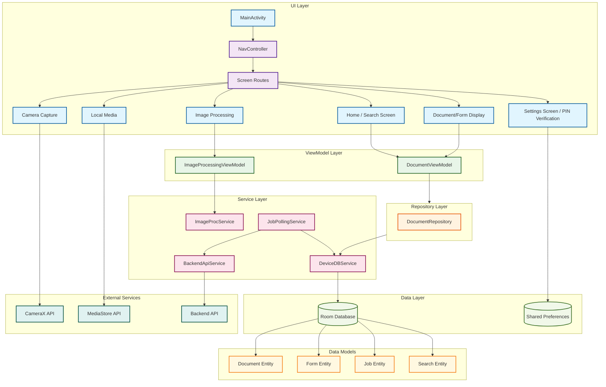

# DocuSnap Project Architecture Diagram

## Architecture Overview

### Layer Descriptions

**UI Layer (Jetpack Compose)**

- Contains all user interface components built with Jetpack Compose
- Implements Material Design 3 principles
- Provides declarative, reactive UI components

**Navigation Layer**

- Manages screen transitions using Jetpack Navigation Compose
- Implements type-safe routing with sealed classes
- Handles deep linking and argument passing

**ViewModel Layer**

- Manages business logic and state using MVVM pattern
- Implements reactive programming with StateFlow
- Provides clean separation between UI and data layers

**Repository Layer**

- Abstracts data access through repository pattern
- Coordinates between multiple data sources
- Provides unified data interface for ViewModels

**Service Layer**

- Handles background operations and external integrations
- Manages image processing, camera operations, and API calls
- Implements job polling for long-running operations

**Data Layer**

- Local data persistence using Room Database
- Shared preferences for application settings
- File system access for image storage

**External Services**

- CameraX for camera functionality
- MediaStore for gallery access
- Backend API for remote processing

**UI Components**

- Reusable UI components for consistent design
- Specialized components for document and form display
- Interactive components for image processing

**Data Models**

- Entity classes for database operations
- Model classes for business logic
- Search and analytics data structures

**Dependency Injection**

- AppModule for service instantiation
- Factory patterns for ViewModel creation
- Singleton management for shared services
