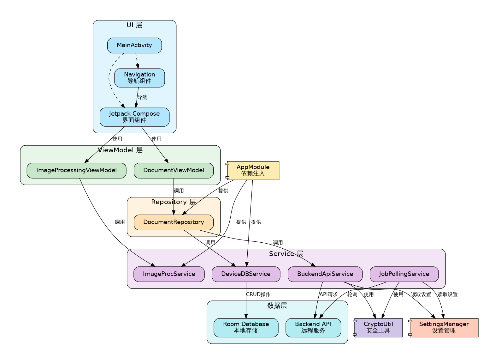

# Overall Architecture and Layer Description

DocuSnap-Frontend adopts the **MVVM (Model-View-ViewModel)** architecture pattern, combined with the **Repository pattern** and a **layered architecture**. This approach ensures a clear separation of concerns and improves maintainability.

## Architecture Diagram

*Note: The architecture diagram shows the relationships between different layers and components of the application.*

## Layer Description

The application is divided into the following layers:

### UI Layer

**Responsibility**: Build user interfaces, handle user interactions, display data

**Main Components**:
- `MainActivity`: Main entry point of the application
- `JetpackCompose` UI components: Build declarative UIs
- `Navigation` components: Manage screen navigation

### ViewModel Layer

**Responsibility**: Manage UI state, handle business logic, connect UI and data layers

**Main Components**:
- `DocumentViewModel`: Manage document-related operations and state
- `ImageProcessingViewModel`: Handle image processing logic and state

### Repository Layer

**Responsibility**: Abstract data access logic, coordinate multiple data sources

**Main Components**:
- `DocumentRepository`: Provide document data access interface

### Service Layer

**Responsibility**: Provide specific functional services, handle background operations

**Main Components**:
- `DeviceDBService`: Local database service
- `JobPollingService`: Backend job polling service
- `BackendApiService`: Backend API communication service
- `ImageProcService`: Image processing service

### Data Layer

**Responsibility**: Provide data storage and access

**Main Components**:
- `Room Database`: Local data storage
- `Backend API`: Remote service interface

## Data Flow

Data in the application follows a unidirectional flow principle:

1. User interactions in the UI layer trigger actions in the ViewModel layer
2. The ViewModel layer processes these actions and requests data from the Repository layer
3. The Repository layer retrieves data from either local or remote data sources
4. The data flows back through the Repository to the ViewModel
5. The ViewModel updates its state, which is observed by the UI layer
6. The UI layer automatically updates to reflect the new state

This architecture provides a clear separation of concerns, improves testability, and enhances maintainability of the application.