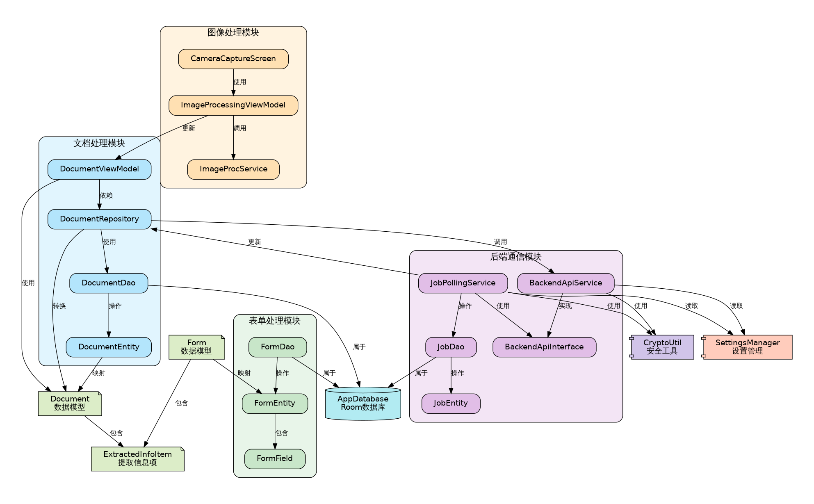

# Module Interactions

The core modules of DocuSnap-Frontend have complex interactions with each other. This page describes these relationships and how the modules work together to provide the application's functionality.

## Module Relationship Diagram

## Key Interaction Relationships

### 1. Document Processing Module and Image Processing Module

- Image data is passed from the Image Processing module to the Document Processing module after processing
- `ImageProcessingViewModel` updates `DocumentViewModel` after image processing is complete
- Both modules share common image handling utilities and services
- Document processing depends on image quality improvements from the image processing module

### 2. Document Processing Module and Backend Communication Module

- Document processing requires backend services for OCR and text extraction
- `DocumentRepository` calls `BackendApiService` to send processing requests
- `JobPollingService` retrieves processing results and updates `DocumentRepository`
- The document module relies on secure communication provided by the backend module

### 3. Form Processing Module and Image Processing Module

- Form capture and processing depend on the Image Processing module
- Both modules share the same image processing workflows and algorithms
- Form processing uses enhanced images from the image processing module for better field extraction
- Both modules use the camera interface provided by the image processing module

### 4. Form Processing Module and Backend Communication Module

- Form field extraction requires backend service support
- Processing results are retrieved through the same job polling mechanism
- Form data is securely transmitted using the encryption mechanisms of the backend communication module
- Form processing status is tracked through the job management system

### 5. Shared Components and Core Modules

- `CryptoUtil`: Provides encryption functionality used by the Backend Communication module
- `SettingsManager`: Manages application settings affecting the behavior of multiple modules
- `AppDatabase`: Provides data storage shared by all modules
- Common utilities and extensions are used across all modules

## Data Flow Between Modules

The data flow between modules typically follows these patterns:

1. **Image Capture to Document/Form Creation**:
   - Camera interface (Image Processing) → Image processing → Document/Form creation
   - Image data flows from the Image Processing module to either the Document or Form Processing module

2. **Document/Form Processing**:
   - Document/Form data → Backend Communication → Backend processing → Results retrieval
   - Processed data flows back to the Document/Form Processing module

3. **User Interaction Flow**:
   - UI events → ViewModel processing → Repository operations → Data updates
   - Updated data flows back through the ViewModel to the UI

## Benefits of Modular Design

The modular design of DocuSnap-Frontend offers several advantages:

- **Separation of Concerns**: Each module focuses on specific functionality
- **Clear Communication Interfaces**: Modules communicate through well-defined interfaces
- **Team Collaboration**: Facilitates development by different team members
- **Independent Evolution**: Modules can evolve independently
- **Testability**: Modules can be tested in isolation
- **Reusability**: Components can be reused across different parts of the application

This modular architecture ensures that the application is maintainable, extensible, and robust, while allowing for efficient development and testing.