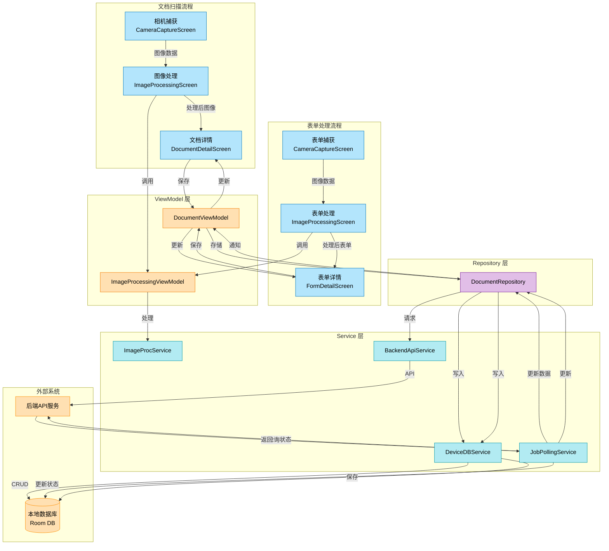

# Document Scanning and Processing Flow

Document scanning and processing is one of the core functionalities of DocuSnap-Frontend. This process involves multiple modules and components working together. The following diagram illustrates the complete flow from image capture to document storage:

## Detailed Document Scanning Process

### 1. Image Capture Phase

- User captures document images through the `CameraCaptureScreen`
- Image data is passed to the `ImageProcessingScreen`
- The camera interface uses CameraX API to ensure consistent camera experience across devices
- Users can also select images from the device gallery as an alternative

### 2. Image Processing Phase

- `ImageProcessingScreen` calls `ImageProcessingViewModel` to process the image
- `ImageProcessingViewModel` uses `ImageProcService` to apply edge detection, perspective correction, and image enhancement
- Users can adjust processing parameters and apply filters
- Processed images are passed to the `DocumentDetailScreen`

### 3. Document Creation Phase

- `DocumentDetailScreen` calls `DocumentViewModel` to create a document object
- User inputs document name, description, and tags
- `DocumentViewModel` calls `DocumentRepository` to save the document
- Document metadata is collected and associated with the processed images

### 4. Local Storage Phase

- `DocumentRepository` calls `DeviceDBService` to store the document in the local database
- `DeviceDBService` uses Room DAO to perform database operations
- Document is stored with its metadata and processed images
- Local storage ensures offline access to documents

### 5. Backend Processing Phase

- `DocumentRepository` calls `BackendApiService` to send the document to the backend for processing
- `BackendApiService` encrypts document data and sends an API request
- Backend returns a job ID, and `BackendApiService` creates a job record
- The document is marked as "processing" in the local database

### 6. Job Polling Phase

- `JobPollingService` begins polling for job status
- When the job completes, `JobPollingService` retrieves and decrypts the results
- Processing results (extracted text, identified fields, etc.) are updated in the local database
- The document status is updated to "processed"

### 7. UI Update Phase

- Database updates trigger Flow emissions with new values
- `DocumentViewModel` receives updates and updates the UI state
- `DocumentDetailScreen` automatically refreshes to display extracted text information
- User can view and interact with the processed document

## Data Flow and State Management

This process demonstrates the application's unidirectional data flow and reactive update mechanism:

1. **User Actions**: User interactions trigger events in the UI layer
2. **ViewModel Processing**: ViewModels process these events and update repositories
3. **Data Operations**: Repositories perform data operations (local and remote)
4. **State Updates**: Data changes update ViewModels' states
5. **UI Reactions**: UI automatically reacts to state changes

This pattern ensures consistency between the UI and the underlying data, making the application more predictable and easier to debug.

## Error Handling

The document scanning process includes robust error handling:

- Camera errors are handled with appropriate user feedback
- Image processing failures provide recovery options
- Network errors during backend processing are managed with retry mechanisms
- Job polling includes exponential backoff for failed attempts
- Database errors are handled with appropriate fallbacks

These error handling mechanisms ensure that the document scanning process is resilient and provides a smooth user experience even when issues occur.